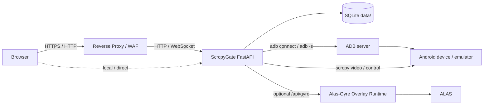

# ScrcpyGate

English | [简体中文](README.md)

ScrcpyGate is a FastAPI, native WebSocket, and scrcpy based browser gateway for Android screen mirroring and remote control. It is designed for network ADB devices, multi-user viewing, permission control, mobile operation, low upload bandwidth, and reverse-proxy deployments.

It is not a thin page that simply exposes ADB. It is a lightweight management gateway with login, device authorization, explicit control locks, security boundaries, audit logs, and tunable video quality profiles.

## Table of Contents

- [Use Cases](#use-cases)
- [Highlights](#highlights)
- [Architecture](#architecture)
- [Safety Boundary](#safety-boundary)
- [Quick Start](#quick-start)
- [First-Time Setup](#first-time-setup)
- [Reverse Proxy Deployment](#reverse-proxy-deployment)
- [Video Quality and Stream Modes](#video-quality-and-stream-modes)
- [ALAS / Alas-Gyre Overlay](#alas--alas-gyre-overlay)
- [Common Commands](#common-commands)
- [Configuration](#configuration)
- [Troubleshooting](#troubleshooting)
- [Development Checks](#development-checks)
- [Acknowledgements](#acknowledgements)
- [License](#license)

## Use Cases

ScrcpyGate is useful when you need to:

- remotely access Android emulators over LAN or behind a reverse proxy
- allow multiple users to watch one device while only one user controls it
- avoid exposing real ADB addresses and ports to normal users
- reduce upload bandwidth with low-bitrate and low-output-size presets
- stop idle mirror sessions automatically to save bandwidth
- expose ALAS start, stop, and restart controls through your own UI
- deploy with Docker while keeping audit logs and explicit security settings

It is not focused on:

- plug-and-play USB ADB management
- WebRTC ultra-low-latency streaming
- reverse-proxying the original ALAS web UI while hiding its config list
- changing the real Android device resolution

## Highlights

| Area | Capability |
| --- | --- |
| Backend | FastAPI, Uvicorn, native WebSocket |
| Video | scrcpy H264 output with jMuxer playback |
| Data | SQLite database under `data/` |
| Users | Login, admin users, normal users, self-service password change |
| Devices | Device management, permissions, network ADB auto-connect and heartbeat |
| Control | Explicit control locks to prevent simultaneous control conflicts |
| Quality | Smooth, stable, sharp, and low-latency presets with admin tuning |
| Security | Host, Origin, CSRF, trusted-proxy checks, security response headers |
| Privacy | Real ADB IP and port hidden from normal user APIs and UI |
| ALAS | Proxy for Alas-Gyre Overlay start, stop, and restart |
| Operations | Docker Compose, health check, audit log, runtime log |

## Architecture



Design points:

- Browsers talk to ScrcpyGate, not directly to ADB.
- Normal users receive public device IDs instead of real ADB addresses.
- Video and control channels are separated.
- Multiple browsers can watch the same device; control is governed by a lock.
- ALAS tokens stay on the backend and are never shown to normal users.

## Safety Boundary

ScrcpyGate only changes the scrcpy output stream. It must not change the real Android device or emulator display configuration.

Do not add runtime paths for:

- `wm size`
- `wm density`
- `modifydev`
- changing `Physical size`
- changing `Override size`

This is especially important for ALAS setups, where automation often depends on a fixed real emulator resolution such as `1280x720`. The web UI output size maps only to scrcpy `max_size`; it does not change the real device resolution.

Also note:

- Do not commit `.env`, `data/`, databases, logs, or initial password files.
- Public deployments should use HTTPS.
- Set `TRUST_PROXY=true` only when requests really come from a trusted reverse proxy.
- Set `TRUSTED_PROXY_IPS` to the real source IP or CIDR of that proxy.
- Do not expose the original ALAS web UI directly to normal users.

## Quick Start

### Requirements

- Docker
- Docker Compose
- An Android device or emulator reachable through network ADB

### Start the Service

```bash
cp .env.example .env
docker compose -f docker-compose.v2.yml up -d --build
```

Default URL:

```text
http://127.0.0.1:5000
```

### Using the Deployment Helper

```bash
chmod +x deploy-v2.sh
./deploy-v2.sh
```

When a new database is created, the script prints the initial admin account:

```text
username: admin
password: <auto-generated-password>
```

The initial password is printed once during deployment and is not stored in plaintext under `data/`. If it is lost, reset the admin account with the command below.

## First-Time Setup

1. Log in to the admin panel as `admin`.
2. Add a device on the Devices page:
   - Device ID: use an alias such as `emu-1`
   - Name: the display name shown to users
   - ADB address: the real connection address, such as `192.0.2.10:30100`
3. Click Test ADB and confirm the device is online.
4. Create normal users on the Users page.
5. Grant each user device view/control permissions.
6. Choose default quality presets on the Video page.
7. Return to the mirror page, select a device, and start mirroring.

Normal users only see authorized devices. They do not see real ADB addresses.

## Reverse Proxy Deployment

When deploying behind HTTPS, a WAF, or a reverse proxy, explicitly configure the public URL, allowed hosts, allowed origins, and trusted proxy source.

Example:

```bash
WEB_SCRCPY_BIND=127.0.0.1 \
PUBLIC_BASE_URL=https://example.com \
ALLOWED_HOSTS=example.com,127.0.0.1,localhost \
ALLOWED_ORIGINS=https://example.com \
SESSION_COOKIE_SECURE=true \
TRUST_PROXY=true \
TRUSTED_PROXY_IPS=127.0.0.1 \
SCRCPY_STREAM_MODE=raw \
./deploy-v2.sh
```

If the reverse proxy runs on another machine, set `TRUSTED_PROXY_IPS` to the source IP used by that proxy when it connects to ScrcpyGate.

For direct LAN access:

```bash
WEB_SCRCPY_BIND=0.0.0.0 \
PUBLIC_BASE_URL=http://192.168.1.10:5000 \
ALLOWED_HOSTS=192.168.1.10,127.0.0.1,localhost \
ALLOWED_ORIGINS=http://192.168.1.10:5000 \
SESSION_COOKIE_SECURE=false \
TRUST_PROXY=false \
./deploy-v2.sh
```

Replace `192.168.1.10` with your server LAN IP.

## Video Quality and Stream Modes

Default stream mode:

```env
SCRCPY_STREAM_MODE=raw
```

Keep `raw` as the default mode unless you have tested another mode in your environment. `protocol` and `legacy` remain available as optional diagnostic modes and can be enabled from the admin panel.

### Quality Presets

| Preset | Goal | Suggested use |
| --- | --- | --- |
| Smooth | Minimum bandwidth pressure | Weak upload bandwidth or mobile networks |
| Stable | Stability first | Everyday default |
| Sharp | Clearer image | Better upload bandwidth |
| Low latency | Faster control response | Frequent tapping or swiping |

Admins can tune each preset:

- bitrate
- output size
- frame rate

These values only affect the scrcpy output stream. Some changes may require restarting the mirror session to fully take effect.

## ALAS / Alas-Gyre Overlay

ALAS control requires Alas-Gyre Overlay Runtime to be installed and running first. ScrcpyGate does not run ALAS directly; it only proxies user actions to the Overlay API.

The admin ALAS page needs:

- Runtime URL, for example `http://127.0.0.1:22267`
- API Token
- Current config name
- User-to-config bindings

Normal users can only start, stop, or restart their bound ALAS config. The frontend does not expose all configs, config content, or the Runtime Token.

Related projects:

- [ALAS / AzurLaneAutoScript](https://github.com/LmeSzinc/AzurLaneAutoScript)
- [Alas-Gyre Overlay](https://github.com/Ange-Katrina/Alas-Gyre)

## Common Commands

Show containers:

```bash
docker compose -f docker-compose.v2.yml ps
```

Show logs:

```bash
docker logs --tail=120 web-scrcpy-v2
```

Stop the service:

```bash
docker compose -f docker-compose.v2.yml down
```

Rebuild:

```bash
docker compose -f docker-compose.v2.yml up -d --build
```

Show the initial password:

```bash
docker compose -f docker-compose.v2.yml exec -T web-scrcpy-v2 python -m app.cli initial-password
```

Reset admin:

```bash
docker compose -f docker-compose.v2.yml exec -T web-scrcpy-v2 python -m app.cli reset-admin
```

Health check:

```bash
curl -fsS http://127.0.0.1:5000/healthz
```

## Configuration

Common environment variables:

| Variable | Default | Description |
| --- | --- | --- |
| `WEB_SCRCPY_BIND` | `127.0.0.1` | Host bind address |
| `WEB_SCRCPY_PORT` | `5000` | Host port |
| `WEB_SCRCPY_DATA_HOST` | `./data` | Host data directory |
| `PUBLIC_BASE_URL` | `http://127.0.0.1:5000` | Public base URL |
| `ALLOWED_HOSTS` | `127.0.0.1,localhost` | Allowed Host values |
| `ALLOWED_ORIGINS` | empty | Allowed Origin values |
| `ALLOW_NULL_ORIGIN` | `false` | Allow `Origin: null` in WAF/proxy deployments |
| `SESSION_COOKIE_SECURE` | `false` | Send session cookies only over HTTPS |
| `TRUST_PROXY` | `false` | Trust reverse proxy headers |
| `TRUSTED_PROXY_IPS` | `127.0.0.1,::1` | Trusted proxy IPs or CIDRs |
| `ENABLE_API_DOCS` | `false` | Enable FastAPI `/docs`, `/redoc`, and `/openapi.json` |
| `MIN_PASSWORD_LENGTH` | `12` | Minimum password length |
| `PASSWORD_PBKDF2_ITERATIONS` | `310000` | PBKDF2-SHA256 password hash iterations |
| `LOGIN_RATE_LIMIT_ENABLED` | `true` | Enable login brute-force protection |
| `LOGIN_RATE_LIMIT_MAX` | `6` | Failed login attempts allowed per window |
| `LOGIN_RATE_LIMIT_WINDOW_SECONDS` | `300` | Failed login counting window in seconds |
| `LOGIN_LOCKOUT_SECONDS` | `600` | Lockout duration after the limit is reached |
| `ADB_AUTOCONNECT` | `true` | Auto-connect enabled devices on startup |
| `ADB_HEARTBEAT_INTERVAL` | `15` | ADB heartbeat interval in seconds |
| `ADB_CONNECT_TIMEOUT` | `8` | ADB connection timeout in seconds |
| `ADB_RECONNECT_BACKOFF` | `5` | ADB reconnect backoff in seconds |
| `SCRCPY_STREAM_MODE` | `raw` | Default scrcpy stream mode |
| `SCRCPY_STREAM_HEALTH_TIMEOUT` | `5` | Video stream health timeout |
| `VIDEO_QUEUE_MAXSIZE` | `60` | Per-client video queue hard limit |
| `VIDEO_QUEUE_SOFT_LIMIT` | `45` | Per-client video queue soft limit; waits for a keyframe after dropping stale frames |
| `LOG_LEVEL` | `INFO` | Log level |

See [.env.example](.env.example) for more options.

## Project Layout

```text
./
  app/                    FastAPI backend
  templates/              Plain HTML pages
  static/                 Frontend JS/CSS assets
  tests/                  Unit tests
  adb/                    Android platform-tools compatibility files
  Dockerfile              Docker image build file
  docker-compose.v2.yml   Docker Compose file
  deploy-v2.sh            Deployment helper
  README.md               Chinese documentation
  README.en.md            English documentation
```

## Troubleshooting

### The site shows Forbidden

Common causes:

- `ALLOWED_HOSTS` does not include the current domain or IP
- `ALLOWED_ORIGINS` does not include the current page origin
- a reverse proxy or WAF makes browser login requests send `Origin: null`, but `ALLOW_NULL_ORIGIN=true` is not set
- a reverse proxy sends `X-Forwarded-*` headers but `TRUST_PROXY` and `TRUSTED_PROXY_IPS` are not configured correctly

Check logs:

```bash
docker logs --tail=120 web-scrcpy-v2
```

Look for `HOST_REJECT`, `ORIGIN_REJECT`, or `PROXY_HEADER_REJECT`.

### Login returns to the login page

Check:

- whether HTTPS deployments set `SESSION_COOKIE_SECURE=true`
- whether direct HTTP LAN deployments accidentally set `SESSION_COOKIE_SECURE=true`
- whether `PUBLIC_BASE_URL`, `ALLOWED_HOSTS`, and `ALLOWED_ORIGINS` match the actual access URL

### Mirror start fails

Check:

- the real ADB address in the admin device form
- whether Test ADB reports online
- whether the container can reach the device network
- whether ADB debugging is authorized on the device

### Black screen or corrupted video

Suggestions:

- use `raw` stream mode by default
- lower bitrate, output size, and frame rate
- stop and restart the mirror session
- check runtime logs for scrcpy and WebSocket errors

### ALAS does not start

Check:

- Alas-Gyre Overlay Runtime is running
- Runtime URL is reachable from ScrcpyGate
- API Token matches
- the user has an ALAS config binding

## Development Checks

Compile check:

```bash
python -m compileall -q .
```

Unit tests:

```bash
python -m unittest discover -s tests
```

Inline template JavaScript syntax check:

```bash
node -e "const fs=require('fs'); for (const f of ['templates/index.html','templates/admin.html','templates/login.html']) { const html=fs.readFileSync(f,'utf8'); const scripts=[...html.matchAll(/<script(?![^>]*\\bsrc=)[^>]*>([\\s\\S]*?)<\\/script>/gi)].map(m=>m[1]); scripts.forEach((s,i)=>new Function(s)); console.log(f+' ok'); }"
```

Resolution safety scan:

```bash
rg -n "wm size|wm density|modifydev|Physical size|Override size" .
```

Sensitive data scan example:

```bash
rg -n "BEGIN PRIVATE|BEGIN OPENSSH|ALAS_GYRE_API_TOKEN=|sk-[A-Za-z0-9]" .
```

## Acknowledgements

ScrcpyGate's early direction and parts of its implementation were inspired by the original project [baixin1228/web-scrcpy](https://github.com/baixin1228/web-scrcpy). Thanks to that project for the Web-based scrcpy mirroring idea, baseline structure, and practical reference.

Thanks also to these open-source projects:

- [Genymobile/scrcpy](https://github.com/Genymobile/scrcpy): Android screen capture and control.
- [webstream-labs/jmuxer](https://github.com/webstream-labs/jmuxer): H264 remuxing and MSE playback in the browser.
- [FastAPI](https://github.com/fastapi/fastapi): HTTP and WebSocket backend framework.

## License

ScrcpyGate is licensed under the Apache License 2.0. See [LICENSE](LICENSE).

Third-party components and provenance notes are listed in [THIRD_PARTY.md](THIRD_PARTY.md).
