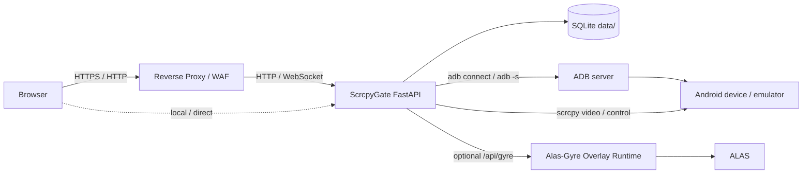

# ScrcpyGate

[English](README.en.md) | 简体中文

ScrcpyGate 是一个基于 FastAPI、原生 WebSocket 和 scrcpy 的浏览器投屏网关。它面向网络 ADB 设备、多人观看、权限控制、移动端操作、低上行带宽和反向代理部署场景。

它不是一个公开暴露 ADB 的简单网页外壳，而是一个带登录、设备授权、控制锁、安全边界、审计日志和可调画质策略的轻量管理网关。

## 目录

- [适用场景](#适用场景)
- [核心特性](#核心特性)
- [架构概览](#架构概览)
- [安全边界](#安全边界)
- [快速开始](#快速开始)
- [首次配置流程](#首次配置流程)
- [反向代理部署](#反向代理部署)
- [画质与流模式](#画质与流模式)
- [ALAS / Alas-Gyre Overlay](#alas--alas-gyre-overlay)
- [常用命令](#常用命令)
- [配置项](#配置项)
- [故障排查](#故障排查)
- [开发检查](#开发检查)
- [致谢](#致谢)
- [许可证](#许可证)

## 适用场景

ScrcpyGate 适合这些使用方式：

- 在局域网或反向代理后远程访问 Android 模拟器
- 多个用户观看同一台设备，但同一时间只允许一个人控制
- 不想把真实 ADB 地址、端口和控制能力直接暴露给普通用户
- 上行带宽有限，需要低码率、低分辨率输出和自动停止空闲投屏
- 需要把 ALAS 的启动、停止、重启能力代理到用户界面
- 希望 Docker 部署后保留清晰的审计日志和安全配置

不适合这些目标：

- 需要 USB ADB 即插即用管理
- 需要 WebRTC 超低延迟
- 需要浏览器直接访问 ALAS 原网页并隐藏配置列表
- 需要修改 Android 设备真实分辨率

## 核心特性

| 模块 | 能力 |
| --- | --- |
| 后端 | FastAPI、Uvicorn、原生 WebSocket |
| 视频 | scrcpy H264 输出，浏览器端 jMuxer 播放 |
| 数据 | SQLite，默认数据目录 `data/` |
| 用户 | 登录、管理员、普通用户、用户自助改密 |
| 设备 | 设备管理、权限分配、网络 ADB 自动连接、心跳保活 |
| 控制 | 显式控制锁，防止多人同时操作同一设备 |
| 画质 | 流畅、稳定、高清、低延迟预设，后台可调默认值 |
| 安全 | Host / Origin / CSRF / Trusted Proxy 检查，安全响应头 |
| 隐私 | 普通用户 API 和界面隐藏真实 ADB IP:端口 |
| ALAS | 代理 Alas-Gyre Overlay，支持多配置单一归属、分项权限和嵌入访问 |
| 运维 | Docker Compose、健康检查、审计日志、运行日志 |

## 架构概览



核心设计：

- 浏览器只访问 ScrcpyGate，不直接访问 ADB。
- 普通用户拿到的是设备公开 ID，不是真实 ADB 地址。
- 视频通道和控制通道分离。
- 多个浏览器可以观看同一设备，控制权由控制锁决定。
- ALAS Token 只保存在后端，普通用户前台不可见。

## 安全边界

ScrcpyGate 只调整 scrcpy 输出流，不修改 Android 设备或模拟器的真实显示参数。

严禁加入以下运行时能力：

- `wm size`
- `wm density`
- `modifydev`
- 修改 `Physical size`
- 修改 `Override size`

这对 ALAS 场景尤其重要，因为 ALAS 通常依赖固定的模拟器真实分辨率，例如 `1280x720`。网页里的“输出尺寸”只映射到 scrcpy `max_size`，不会改变设备真实分辨率。

还需要注意：

- 不要提交 `.env`、`data/`、数据库、日志或初始密码文件。
- 公网部署必须使用 HTTPS。
- 只有在请求确实来自可信反向代理时才启用 `TRUST_PROXY=true`。
- `TRUSTED_PROXY_IPS` 应填写反向代理的真实来源 IP 或 CIDR。
- 不建议把 ALAS 原网页直接暴露给普通用户。

## 快速开始

### 环境要求

- Docker
- Docker Compose
- 可通过网络 ADB 访问的 Android 设备或模拟器

### 使用部署脚本（推荐）

```bash
cp .env.example .env
chmod +x deploy-v2.sh
./deploy-v2.sh
```

脚本会构建镜像、初始化数据库、启动服务，并在首次创建数据库时输出管理员账号：

```text
username: admin
password: <auto-generated-password>
```

初始密码只会显示一次，不会以明文写入 `data/`。如果忘记密码，请使用后面的 `reset-admin` 命令重置。

### 手动使用 Docker Compose

```bash
cp .env.example .env
docker compose -f docker-compose.v2.yml build
docker compose -f docker-compose.v2.yml run --rm --no-deps web-scrcpy-v2 python -m app.cli bootstrap-admin
docker compose -f docker-compose.v2.yml up -d
```

请保存 `bootstrap-admin` 输出的初始密码，再启动服务。不要在首次初始化前直接执行 `docker compose up`，否则自动生成的密码不会显示。已有数据库需要重置密码时，使用后面的 `reset-admin` 命令。

默认访问地址：

```text
http://127.0.0.1:5000
```

## 首次配置流程

1. 使用 `admin` 登录后台。
2. 在“设备”页添加设备：
   - 设备 ID：建议使用别名，例如 `emu-1`
   - 名称：显示给用户看的名称
   - ADB 地址：真实连接地址，例如 `192.0.2.10:30100`
3. 点击“测试 ADB”，确认设备状态为 online。
4. 在“用户权限”页创建普通用户。
5. 给用户分配设备查看和控制权限。
6. 在“画质”页选择适合上行带宽的默认预设。
7. 回到投屏页，选择设备并开始投屏。

普通用户只能看到被授权设备，不会看到真实 ADB 地址。

## 反向代理部署

在 HTTPS、WAF 或反向代理后部署时，需要显式配置对外地址、Host、Origin 和可信代理来源。

示例：

```bash
WEB_SCRCPY_BIND=127.0.0.1 \
PUBLIC_BASE_URL=https://example.com \
ALLOWED_HOSTS=example.com,127.0.0.1,localhost \
ALLOWED_ORIGINS=https://example.com \
SESSION_COOKIE_SECURE=true \
TRUST_PROXY=true \
TRUSTED_PROXY_IPS=127.0.0.1 \
SCRCPY_STREAM_MODE=raw \
./deploy-v2.sh
```

如果反向代理不在同一台机器，请把 `TRUSTED_PROXY_IPS` 改成反向代理访问 ScrcpyGate 时的来源 IP。

如果局域网直接访问，可以使用：

```bash
WEB_SCRCPY_BIND=0.0.0.0 \
PUBLIC_BASE_URL=http://192.168.1.10:5000 \
ALLOWED_HOSTS=192.168.1.10,127.0.0.1,localhost \
ALLOWED_ORIGINS=http://192.168.1.10:5000 \
SESSION_COOKIE_SECURE=false \
TRUST_PROXY=false \
./deploy-v2.sh
```

把 `192.168.1.10` 替换为你的服务器局域网 IP。

## 画质与流模式

ScrcpyGate 的画质设置只控制 scrcpy 输出流，不修改 Android 设备或模拟器真实分辨率。
也就是说，后台和前台里的“输出尺寸”会传给 scrcpy 的 `max_size`，不会执行 `wm size`、`wm density`，也不会改 `Physical size` 或 `Override size`。

### 流模式

默认流模式：

```env
SCRCPY_STREAM_MODE=raw
```

| 模式 | 状态 | 作用 | 建议 |
| --- | --- | --- | --- |
| `raw` | 推荐默认 | scrcpy 直接输出 H264 Annex-B，后端按纯 H264 推给浏览器 | 优先使用，公网部署也建议先保持此模式 |
| `protocol` | 诊断/备用 | 解析完整 scrcpy video protocol，再拆出 H264 | 当前兼容性依赖 scrcpy server 版本，稳定前不建议给普通用户开放 |
| `legacy` | 诊断 | 旧版 H264 起始码扫描兼容路径 | 只用于排查，不建议生产长期使用 |

后台可以配置“允许的流模式”。如果只启用 `raw`，即使用户请求 `protocol`，后端也会回退到 `raw`。这适合在 `protocol` 未稳定前先禁用，避免用户误选导致黑屏或绿屏。

### 画质预设

画质预设由三个核心参数组成：

| 参数 | 单位 | 作用 | 说明 |
| --- | --- | --- | --- |
| `video_bit_rate` | bps | 视频目标码率 | 越高越清晰，但越占上行；低带宽环境优先压低它 |
| `max_size` | px | 输出流长边尺寸 | 只影响投屏输出，不改设备分辨率；`480` 表示输出长边不超过 480px |
| `max_fps` | fps | 输出最大帧率 | 越高越顺滑，但码率和 CPU 压力也会上升 |

内置默认值：

| 预设 | 码率 | 输出尺寸 | 帧率 | 目标 | 建议场景 |
| --- | ---: | ---: | ---: | --- | --- |
| 流畅 `smooth` | 700 Kbps | 480 | 24 | 尽量省上行 | 上行紧张、多人观看、移动网络 |
| 稳定 `balanced` | 900 Kbps | 540 | 24 | 稳定优先 | 默认推荐，兼顾清晰度和带宽 |
| 高清 `sharp` | 1.6 Mbps | 720 | 30 | 更清晰 | 上行较充足、画面细节更重要 |
| 低延迟 `low_latency` | 900 Kbps | 480 | 30 | 操作响应优先 | 频繁点击、滑动、需要更跟手 |

带宽推荐会在后台“一键套用”到四个内置预设。它不是固定限制，而是帮管理员根据服务器上行快速生成一组更合理的默认值。

| 上行档位 | 流畅 | 稳定 | 高清 | 低延迟 | 说明 |
| --- | --- | --- | --- | --- | --- |
| 2 Mbps | 450K / 720 / 20 | 650K / 720 / 24 | 1.1M / 720 / 24 | 750K / 720 / 30 | 极低上行，优先控制码率和帧率 |
| 5 Mbps | 700K / 720 / 24 | 1.2M / 720 / 24 | 2.2M / 720 / 30 | 1.2M / 720 / 30 | 家宽低上行或多人共用 |
| 10 Mbps | 900K / 720 / 24 | 1.8M / 720 / 24 | 3.5M / 960 / 30 | 1.8M / 720 / 30 | 常见可用档，清晰度明显提升 |
| 20 Mbps | 1.2M / 720 / 24 | 2.8M / 720 / 30 | 5.5M / 1280 / 30 | 2.8M / 720 / 30 | 上行较充足，可给高清更多空间 |

表格格式为：`码率 / 输出尺寸 / 帧率`。

后台可以修改每个预设的：

- 码率
- 输出尺寸
- 帧率
- 自定义预设名称和值

使用建议：

- 上行有限时，优先降低 `video_bit_rate`，其次降低 `max_size`，最后再降 `max_fps`。
- 带宽推荐矩阵保证输出尺寸不低于 720；如需 480/540 长边，仍可手动调整或使用原有默认、专属设定。
- 多人同时观看同一设备时，服务器总上行会接近“单路码率 × 观看人数”，应给预设留余量。
- `max_size=0` 表示不限制 scrcpy 输出尺寸，不建议在上行有限或公网环境使用。
- 修改画质后可能需要重启投屏才能完全生效；这不会修改设备真实分辨率，也不会影响 ALAS 对 `1280x720` 模拟器环境的识别。

## ALAS / Alas-Gyre Overlay

ALAS 控制功能需要先安装并启动 Alas-Gyre 的 Overlay Runtime。ScrcpyGate 不直接运行 ALAS，只把用户操作代理到 Overlay API。

后台 ALAS 模块需要配置：

- Runtime URL，例如 `http://127.0.0.1:22267`
- API Token
- Runtime 配置目录
- 用户和 ALAS 配置的一对多归属关系，以及每项配置的运行、编辑和默认入口权限

ScrcpyGate 还可以通过 `/alas/embed/` 代理嵌入 ALAS 原页面。管理员可访问完整原页面；普通用户必须先由管理员分配 ALAS 配置，并只能访问当前选中归属配置内的主页、任务、配置和设置。Runtime URL 可填写 IP、域名或完整 URL；未填写端口时会自动尝试 22267，域名会尝试 80、443、22267。

访问规则与安全注意事项：

- 普通用户前台入口为“打开 ALAS 页面”，管理员后台入口为“打开完整 ALAS 页面”。
- 每个普通用户可以拥有一个或多个 ALAS 配置，并在自己的配置范围内切换；每个配置只能归属一个用户，不能同时分配给多人。管理员可以访问完整 ALAS 原页面。
- 后台“用户授权”管理配置归属；所属用户可以查看状态，并按该项权限启停、编辑或默认使用配置。“配置库”直接操作 Runtime 中的配置实例，不会为用户复制配置。
- 转移配置归属时，应先移除原用户的关系，再把同名配置分配给新用户，避免两个用户同时持有同一配置。
- HTTP / WebSocket 代理会校验登录态、用户角色和 ALAS 绑定关系，并拒绝其它配置、管理入口和未授权长连接消息。
- ALAS Runtime 地址和 Token 只保存在 ScrcpyGate 后端，不会在普通用户界面展示。
- 建议让 ALAS Runtime 只对 ScrcpyGate 或受信局域网可达，不要把 Runtime 直接暴露给普通用户或公网。

普通用户只能查看或操作自己当前选中的归属配置，并受该项配置的运行、编辑权限限制。前台不会暴露其他用户的配置归属、未归属给自己的配置、配置内容或 Runtime Token。

相关项目：

- [ALAS / AzurLaneAutoScript](https://github.com/LmeSzinc/AzurLaneAutoScript)
- [Alas-Gyre Overlay](https://github.com/Ange-Katrina/Alas-Gyre)

## 常用命令

查看容器：

```bash
docker compose -f docker-compose.v2.yml ps
```

查看日志：

```bash
docker logs --tail=120 web-scrcpy-v2
```

停止服务：

```bash
docker compose -f docker-compose.v2.yml down
```

重新构建：

```bash
docker compose -f docker-compose.v2.yml up -d --build
```

重置管理员：

```bash
docker compose -f docker-compose.v2.yml exec -T web-scrcpy-v2 python -m app.cli reset-admin
```

查看健康状态：

```bash
curl -fsS http://127.0.0.1:5000/healthz
```

## 配置项

配置来源有三类：

- `.env` / 环境变量：影响容器启动、网络边界、安全策略和默认运行参数。
- 后台管理页：影响设备、用户、权限、ALAS、画质预设等业务配置，保存到 SQLite。
- 用户个人设置：影响当前用户自己的画质偏好和密码，不改变后台默认值。

更多示例见 [.env.example](.env.example)。

### 部署与数据目录

| 变量 | 默认值 | 作用 | 什么时候修改 |
| --- | --- | --- | --- |
| `WEB_SCRCPY_BIND` | `127.0.0.1` | Docker 端口绑定的宿主机地址 | 局域网直接访问时改为服务器 IP 或 `0.0.0.0`；反代部署建议保持内网地址 |
| `WEB_SCRCPY_PORT` | `5000` | 宿主机暴露端口 | v1 已停用并希望 v2 接管时用 `5000`；并行测试可用 `5001` |
| `WEB_SCRCPY_DATA_HOST` | `./data` | 宿主机数据目录，挂载到容器 `/app/data` | 正式部署建议使用固定绝对路径，例如 `/root/ScrcpyGate/data` |
| `PUBLIC_BASE_URL` | `http://127.0.0.1:5000` | 用户实际访问的外部地址 | 反代、HTTPS、域名、局域网 IP 访问时必须改成真实访问地址 |
| `LOG_LEVEL` | `INFO` | 应用日志级别 | 排查问题时可临时改为 `DEBUG`，稳定后用 `INFO` |

`data/` 中保存 SQLite 数据库、设置、审计日志和运行期状态。不要提交到 GitHub，也不要在升级时删除。

### Host、Origin 与反向代理

| 变量 | 默认值 | 作用 | 说明 |
| --- | --- | --- | --- |
| `ALLOWED_HOSTS` | `127.0.0.1,localhost` | 允许访问的 Host 名称 | 必须包含浏览器地址栏里的域名或 IP，不含协议和端口 |
| `ALLOWED_ORIGINS` | 空 | 允许的浏览器 Origin | 推荐填写完整源，例如 `https://example.com:443` 或 `http://192.168.1.10:5000` |
| `ALLOW_NULL_ORIGIN` | `false` | 是否允许 `Origin: null` | 只建议在本地 file/iframe/WAF 特殊场景临时开启；公网默认不要开启 |
| `TRUST_PROXY` | `false` | 是否信任 `X-Forwarded-*` 代理头 | 只有请求确实来自可信反代时才开启 |
| `TRUSTED_PROXY_IPS` | `127.0.0.1,::1` | 可信代理来源 IP 或 CIDR | 填写反向代理访问 ScrcpyGate 时的真实来源 IP |
| `SESSION_COOKIE_SECURE` | `false` | Cookie 是否仅 HTTPS 发送 | HTTPS 域名部署设为 `true`；纯 HTTP 局域网必须为 `false` |
| `ENABLE_API_DOCS` | `false` | 是否开启 `/docs`、`/redoc`、`/openapi.json` | 仅本地开发调试开启，公网环境保持关闭 |

常见组合：

| 场景 | 推荐配置 |
| --- | --- |
| 本机直接访问 | `PUBLIC_BASE_URL=http://127.0.0.1:5000`，`SESSION_COOKIE_SECURE=false` |
| 局域网 HTTP | `PUBLIC_BASE_URL=http://服务器IP:5000`，`ALLOWED_HOSTS=服务器IP,127.0.0.1,localhost` |
| HTTPS 反代 | `PUBLIC_BASE_URL=https://域名`，`SESSION_COOKIE_SECURE=true`，`TRUST_PROXY=true` |
| WAF 出现 `Origin: null` | 先检查反代配置；确认无法避免时再设 `ALLOW_NULL_ORIGIN=true` |

### 密码与登录保护

| 变量 | 默认值 | 作用 | 说明 |
| --- | --- | --- | --- |
| `MIN_PASSWORD_LENGTH` | `12` | 新密码最小长度 | 管理员创建用户、用户改密码、重置管理员密码都会校验 |
| `PASSWORD_PBKDF2_ITERATIONS` | `310000` | PBKDF2-SHA256 哈希迭代次数 | 越高越抗暴力破解，但登录和改密会更耗 CPU |
| `LOGIN_RATE_LIMIT_ENABLED` | `true` | 登录防爆破开关 | 建议保持开启 |
| `LOGIN_RATE_LIMIT_MAX` | `6` | 单窗口失败次数 | 达到后进入锁定 |
| `LOGIN_RATE_LIMIT_WINDOW_SECONDS` | `300` | 失败统计窗口 | 默认 5 分钟 |
| `LOGIN_LOCKOUT_SECONDS` | `600` | 锁定时间 | 默认 10 分钟 |

初始管理员密码只在首次部署时显示一次，不写入明文文件。忘记后使用：

```bash
docker compose -f docker-compose.v2.yml exec -T web-scrcpy-v2 python -m app.cli reset-admin
```

### ADB 自动连接

| 变量 | 默认值 | 作用 | 说明 |
| --- | --- | --- | --- |
| `ADB_AUTOCONNECT` | `true` | 服务启动后自动连接后台已启用设备 | 避免首次登录后点击投屏才发现 ADB 未连接 |
| `ADB_HEARTBEAT_INTERVAL` | `15` | 心跳间隔秒数 | 定期执行状态检查，掉线后尝试恢复 |
| `ADB_CONNECT_TIMEOUT` | `8` | 单次连接超时秒数 | 网络差或设备较慢时可适当调大 |
| `ADB_RECONNECT_BACKOFF` | `5` | 重连退避秒数 | 避免设备离线时高频重连打满日志 |

后台设备表里的“设备 ID”建议使用别名，例如 `emu-1`；“ADB 地址”填写真实连接地址，例如 `192.0.2.10:30100`。普通用户接口和投屏页不会显示真实 ADB 地址。

### 视频流、队列与稳定性

| 变量 | 默认值 | 作用 | 调整建议 |
| --- | --- | --- | --- |
| `SCRCPY_STREAM_MODE` | `raw` | 默认 scrcpy 流模式 | 生产建议 `raw`；`protocol`、`legacy` 等稳定后再在后台开启 |
| `SCRCPY_STREAM_HEALTH_TIMEOUT` | `5` | 启动后等待关键视频数据的秒数 | 设备启动慢时可调大；太大则失败反馈变慢 |
| `SCRCPY_I_FRAME_INTERVAL` | `1` | Android 编码器自然关键帧间隔，单位秒 | 增大可降低关键帧开销，但丢帧后的自然恢复会变慢 |
| `SCRCPY_SOCKET_READY_TIMEOUT` | `8` | 等待 Android 端 scrcpy 首连接确认的秒数 | 慢设备可适当调大；握手会在服务就绪后立即结束，不固定等待 |
| `VIDEO_RESET_COOLDOWN` | `0.75` | 主动请求新配置和关键帧的最短间隔，单位秒 | 多观看端同时进入时避免反复重置编码器 |
| `CONTROL_LEASE_VERIFY_INTERVAL` | `0.5` | 高频触摸期间重新核验控制锁的间隔，单位秒 | 减少每个 MOVE 都写 SQLite；调小会更快发现控制权变更但增加 I/O |
| `VIDEO_QUEUE_MAXSIZE` | `24` | 每个浏览器视频队列硬上限 | 越大越抗抖动，但延迟和内存占用增加 |
| `VIDEO_QUEUE_SOFT_LIMIT` | `8` | 队列软上限 | 慢客户端超过软上限后丢弃陈旧帧并主动请求新关键帧，不拖垮其他观看端 |

队列是按浏览器客户端隔离的。一个慢客户端卡顿时，只会丢它自己的帧，不会拖慢同设备的其他观看者。新观看端和丢帧后的客户端不会复用旧 IDR，而是通过 scrcpy 控制通道请求新的 SPS/PPS 与关键帧，避免旧参考链导致绿屏或花屏。

### Docker 构建参数

| 参数 | 默认值 | 作用 |
| --- | --- | --- |
| `PYTHON_IMAGE` | `python:3.12-alpine` | Dockerfile 基础镜像 |
| `PIP_INDEX_URL` | 空 | 构建时 pip 镜像源；国内服务器可使用清华、阿里等镜像 |

示例：

```bash
PIP_INDEX_URL=https://pypi.tuna.tsinghua.edu.cn/simple \
docker compose -f docker-compose.v2.yml build
```

### 后台业务参数

这些参数不通过 `.env` 配置，而是在后台保存到 SQLite：

| 模块 | 参数 | 作用 |
| --- | --- | --- |
| 设备 | 设备 ID、名称、ADB 地址、启用状态 | 管理可投屏设备；普通用户只看到名称和在线状态 |
| 权限 | 用户、设备、查看、控制 | 控制谁能看、谁能操作某台设备 |
| 画质 | 默认预设、各预设码率/尺寸/帧率、自定义预设、允许的流模式 | 管理员按网络环境设置默认值，用户可选择预设 |
| ALAS | Runtime URL、Token、配置目录、每项配置唯一用户归属（用户可拥有多项）、默认入口、运行与编辑权限 | 只代理当前用户所拥有且已选中配置的状态、启停、编辑和嵌入访问 |
| 安全日志 | 登录、登出、权限、ALAS、投屏操作记录 | 方便追踪异常登录和越权访问 |

## 项目结构

```text
./
  app/                    FastAPI 后端
  templates/              原生 HTML 页面
  static/                 前端 JS/CSS 资源
  tests/                  单元测试
  adb/                    Android platform-tools 兼容文件
  Dockerfile              Docker 镜像构建文件
  docker-compose.v2.yml   Docker Compose 配置
  deploy-v2.sh            部署辅助脚本
  requirements.txt        生产运行时 Python 依赖
  requirements-dev.txt    开发、测试与审计依赖
  README.md               中文说明
  README.en.md            English documentation
```

## 故障排查

### 访问显示 Forbidden

常见原因：

- `ALLOWED_HOSTS` 没有包含当前访问域名或 IP
- `ALLOWED_ORIGINS` 没有包含当前页面 Origin
- 反向代理或 WAF 让浏览器登录请求携带 `Origin: null`，但没有设置 `ALLOW_NULL_ORIGIN=true`
- 反向代理传了 `X-Forwarded-*`，但没有正确设置 `TRUST_PROXY` 和 `TRUSTED_PROXY_IPS`

处理：

```bash
docker logs --tail=120 web-scrcpy-v2
```

查看是否有 `HOST_REJECT`、`ORIGIN_REJECT` 或 `PROXY_HEADER_REJECT`。

### 登录后仍回到登录页

检查：

- HTTPS 部署时是否设置 `SESSION_COOKIE_SECURE=true`
- HTTP 局域网部署时是否错误设置了 `SESSION_COOKIE_SECURE=true`
- `PUBLIC_BASE_URL`、`ALLOWED_HOSTS`、`ALLOWED_ORIGINS` 是否一致

### 投屏启动失败

检查：

- 后台设备 ADB 地址是否正确
- 后台“测试 ADB”是否 online
- 容器内是否能访问设备网络
- 设备是否允许 ADB 调试

### 黑屏或花屏

建议：

- 默认使用 `raw` 流模式
- 降低画质预设的码率、输出尺寸和帧率
- 停止投屏后重新开始
- 查看运行日志里的 scrcpy 和 WebSocket 错误

### ALAS 无法启动

检查：

- Alas-Gyre Overlay Runtime 是否已启动
- Runtime URL 是否能从 ScrcpyGate 服务访问
- API Token 是否一致
- 用户是否绑定了 ALAS 配置

## 开发检查

安装开发与测试依赖：

```bash
python -m pip install -r requirements-dev.txt
```

编译检查：

```bash
python -m compileall -q app tests
```

单元测试：

```bash
python -m unittest discover -s tests -p "test_*.py"
```

运行时依赖漏洞审计：

```bash
pip-audit -r requirements.txt --progress-spinner off
```

项目维护的前端 JavaScript 语法检查：

```bash
node --check static/js/theme-init.js
node --check static/js/ui-core.js
node --check static/js/input.js
node --check static/js/admin.js
node --check static/js/mirror.js
node --check static/js/login.js
node --check static/js/alas-shell.js
```

分辨率安全扫描：

```bash
rg -n "wm size|wm density|modifydev|Physical size|Override size" .
```

敏感信息扫描示例：

```bash
rg -l --hidden --glob '!.git/**' -- '-----BEGIN (RSA |EC |OPENSSH |DSA )?PRIVATE KEY-----|AKIA[0-9A-Z]{16}|ASIA[0-9A-Z]{16}|gh[pousr]_[A-Za-z0-9_]{30,}|github_pat_[A-Za-z0-9_]{40,}|sk-[A-Za-z0-9_-]{32,}|sk_live_[A-Za-z0-9]{20,}|AIza[0-9A-Za-z_-]{35}|(ALAS_TOKEN|ALAS_GYRE_TOKEN|ALAS_GYRE_API_TOKEN|SESSION_SECRET|INITIAL_ADMIN_PASSWORD)[[:space:]]*=[[:space:]]*[^$<{[:space:]]+' .
```

无输出表示未发现这些高置信凭据形态；扫描只打印文件名，不输出命中内容。

## 致谢

ScrcpyGate 的早期方向和部分实现参考自原始项目 [baixin1228/web-scrcpy](https://github.com/baixin1228/web-scrcpy)。感谢原项目提供 Web 端 scrcpy 投屏思路、基础结构和实践参考。

同时感谢以下开源项目：

- [Genymobile/scrcpy](https://github.com/Genymobile/scrcpy)：Android 投屏与控制核心能力。
- [webstream-labs/jmuxer](https://github.com/webstream-labs/jmuxer)：浏览器端 H264 remux 与 MSE 播放。
- [FastAPI](https://github.com/fastapi/fastapi)：后端 HTTP 与 WebSocket 框架。

## 许可证

ScrcpyGate 使用 Apache License 2.0。详见 [LICENSE](LICENSE)。

第三方组件和来源说明见 [THIRD_PARTY.md](THIRD_PARTY.md)。
