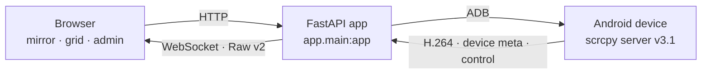

<div align="center">


# ScrcpyGate

**Self-hosted Android screen mirroring and remote control in the browser.**

scrcpy server · native WebSocket · Raw v2 framing · FastAPI · no frontend build step

[](https://github.com/Ange-Katrina/ScrcpyGate/actions/workflows/Builds.yml)
[](LICENSE)
[](https://www.python.org/)
[](https://fastapi.tiangolo.com/)
[](https://github.com/Ange-Katrina/ScrcpyGate/pkgs/container/scrcpygate)
[](THIRD_PARTY.md)

[English](README.md) · [简体中文](README.zh.md)

</div>

---

ScrcpyGate runs the official **scrcpy server** over ADB, forwards the raw H.264 stream to the
browser over a **native WebSocket**, and adds what a shared deployment actually needs: accounts
and roles, device authorization, explicit control leases, tamper-evident audit logging, quality
profiles, and an optional **ALAS** integration.

> It is not a thin page that exposes ADB to the network. It is meant to sit behind a reverse
> proxy / WAF, and it treats *who may watch, who may control, and what gets logged* as
> first-class features.

## Install

```sh
git clone https://github.com/Ange-Katrina/ScrcpyGate.git
cd ScrcpyGate
./deploy.sh --install
```

Then open `http://127.0.0.1:5000` and sign in as `admin`.

**Recommended path.** The installer is the supported way in — it configures, builds, starts and
health-checks the stack for you (details in [Quick start](#quick-start)). Everything below is for
when you want to see or drive the pieces yourself.

| Path | For | Start with |
| --- | --- | --- |
| **[deploy.sh](#recommended-deploysh)** | first installation, and hosts you want guided | `./deploy.sh --install` |
| [Docker](#docker-compose) | you manage the Compose stack yourself | `docker compose up -d --build` |
| [Host network / USB](#special-host-network-and-usb) | host adb server, USB devices, special networking | `docker compose -f compose.host.yaml up -d --build` |
| [Development](#development-uvicorn) | running from source | `uvicorn app.main:app` |

Whatever you choose runs the same image and the same `app.main:app`.

## Contents

- [Highlights](#highlights)
- [How it works](#how-it-works)
- [Quick start](#quick-start)
  - [Recommended: deploy.sh](#recommended-deploysh)
  - [Docker: Compose](#docker-compose)
  - [Special: host network and USB](#special-host-network-and-usb)
  - [Development: uvicorn](#development-uvicorn)
- [Operations](#operations)
- [Advanced and recovery](#advanced-and-recovery)
- [Configuration](#configuration)
- [Security model](#security-model)

## Highlights

| | |
| --- | --- |
| **Mirror and control** | Network ADB devices, several viewers per device, one controller at a time — control is an explicit lease with expiry, and admin takeovers are audited. |
| **Raw v2 streaming** | scrcpy server → per-viewer bounded queue → WebSocket → browser, with keyframe-aware recovery, slow-viewer isolation, adaptive frame sizing and optional low-latency encoder hints. |
| **Rotation follow** | When the device display rotates, capture is rebuilt and viewers are re-primed; the browser keeps the picture upright and fullscreen asks the OS to rotate the screen itself. |
| **Accounts and roles** | Per-user device grants, view/control separation, session and expiry handling, per-role workbench configuration. |
| **Shaped workbench** | Admins choose, per role, which dock buttons exist, which status-bar blocks show, the dock layout (level 1 / "More") and fullscreen behaviour switches. |
| **Audit and notifications** | Hash-chained audit events with alerts and retention controls, plus in-app notifications and viewer history. |
| **ALAS integration** | Optional embedded ALAS UI behind a policy boundary, an outbound gateway with host/CIDR allow-lists, and encrypted tokens whose key lives in the data directory — never in `.env`. |
| **Mobile-first UI** | Multi-page static frontend without a bundler: grid view, fullscreen mirror, edge handle, touch mapping, zh/en i18n. |
| **Docker first** | Multi-arch image (amd64 + arm64), non-root, healthcheck, and sample compose files with `cap_drop: ALL` and `no-new-privileges`. |
| **Release pipeline** | The image is smoke-run and scanned before it ships, published to GHCR with provenance/SBOM, and can be deployed by digest with automatic rollback. A weekly watcher also builds an untested **canary** image when upstream scrcpy releases a new server, so version bumps are validated before `latest` moves. |

## How it works



| Path | What lives there |
| --- | --- |
| `app/routers/` | HTTP and WebSocket API — 93 routes: auth, devices, mirror, ALAS, admin, audit |
| `app/mirror_manager.py`, `app/mirror_runtime.py`, `app/mirror_websocket.py` | session lifecycle, stream fan-out, per-viewer queues, control leases |
| `app/scrcpy_demuxer.py`, `app/h264.py` | Raw v2 framing, NAL / keyframe handling |
| `app/alas_*` | ALAS embed transport, policy, gateway, secrets, visibility |
| `app/security.py`, `app/login_guard.py`, `app/audit_*` | sessions, CSRF / origin rules, brute-force guard, audit chain |
| `static/` | framework-free frontend (pages + shared modules + CSS), no build step |
| `compose.yaml`, `compose.host.yaml` | the two supported deployment shapes |
| `docs/` | advanced deployment recipes (`docker run`) and the README logo |
| `tools/` | deployment helpers (excluded from the image) |

## Quick start

**Requirements** — a Linux host with Docker 24+ and Compose v2 (the installer can add them for
you with `--install-deps`), plus an Android device with USB debugging that is reachable over ADB.

### Recommended: deploy.sh

```sh
git clone https://github.com/Ange-Katrina/ScrcpyGate.git
cd ScrcpyGate
./deploy.sh --install
```

One command, and it does the whole first install in order:

1. creates `.env` from `.env.example` (or drives an interactive wizard with `--configure`),
2. validates the configuration, then checks for port and container conflicts,
3. creates the data directory and generates the ALAS token encryption key,
4. builds the image,
5. fixes the data-directory ownership for the container user (`uid 100` / `gid 101`),
6. creates the admin account and prints its password,
7. starts the stack and waits for the `/healthz` gate.

It ends by printing the URL to open and the admin password. Re-running the same command later is
how you update an existing installation; existing `.env` values, databases and passwords are never
overwritten.

Running `./deploy.sh` with no arguments opens an interactive menu with the same operations —
install/update, start/stop/restart, status, logs, configuration, admin reset, backups, ALAS token
status and migration, environment checks and uninstall.

### Docker: Compose

If you would rather drive the stack yourself, the installer runs exactly this — the pieces are
just yours to manage:

```sh
git clone https://github.com/Ange-Katrina/ScrcpyGate.git
cd ScrcpyGate
cp .env.example .env

# Set the first-run admin password (>= MIN_PASSWORD_LENGTH, 12 characters) in .env:
#   INITIAL_ADMIN_PASSWORD=<strong-password-at-least-12-chars>

# The container runs as uid 100(app):gid 101(app); the host data directory must be writable
# by it, otherwise the app fails at startup with a PermissionError on /app/data/.init-db.lock.
mkdir -p ./data && sudo chown -R 100:101 ./data

docker compose up -d --build
```

Two things the installer did for you and Compose will not: the data-directory ownership above, and
the admin account. If you skip the password, the app generates one and writes it to
`./data/initial_admin_password.txt` (mode `0600`, removed again on the next start) instead of
leaving you locked out — see [Advanced and recovery](#advanced-and-recovery).

### Special: host network and USB

Use `compose.host.yaml` when the container must share the host's network stack — typically to
reuse the host's own adb server (`adb devices` on the host already sees your USB phones) or to
reach a service that only listens on the host's loopback:

```sh
docker compose -f compose.host.yaml up -d --build
```

It inherits the entire service definition from `compose.yaml`, so there is only one place to
maintain. There is no port mapping in this mode: `WEB_SCRCPY_BIND` / `WEB_SCRCPY_PORT` decide
where it binds on the host, so keep them consistent with `PUBLIC_BASE_URL`.

Set `ADB_SERVER_SOCKET=tcp:127.0.0.1:5037` in `.env` to let the container use the host's adb
server. Handing USB devices to the container directly instead needs
`--device /dev/bus/usb --privileged`.

### Development: uvicorn

```sh
python3.12 -m venv .venv && . .venv/bin/activate
pip install -r requirements-dev.txt
export WEB_SCRCPY_DATA_DIR=./data PUBLIC_BASE_URL=http://127.0.0.1:5000 \
       ALLOWED_HOSTS=127.0.0.1,localhost SESSION_COOKIE_SECURE=false
uvicorn app.main:app --host 127.0.0.1 --port 5000
```

> [!IMPORTANT]
> The application never reads `.env` — there is no dotenv loader. It reads the **process
> environment** only. `.env` exists for `docker compose` (`${VAR}` interpolation) and for
> `deploy.sh` (which looks values up by name). Running `uvicorn` directly means exporting the
> variables yourself.

## Operations

CI/CD publishes verified amd64 and arm64 images to GHCR; servers are deployed
manually. See [CI/CD and manual deployment](docs/deployment/ci-cd.md) for
release tags, package permissions, image attestations, and deployment commands.

Health endpoint `GET /healthz`; logs are JSON on stdout (`LOG_FORMAT=json`) with optional file
logging in the data directory.

When a mirror looks wrong ("black for a moment", "frozen", "it stopped by itself"), admins get a
browser-side event timeline in the workbench sidebar (**投屏记录 / Mirror record**): connection
state, keyframe waits, sequence gaps, decoder rebuilds, latency seeks, server resets, socket close
codes, bitrate and resolution changes, and control-lease changes, each with a timestamp. It lives
only in that browser tab's memory (nothing is stored or uploaded) and can be copied or exported as
JSON. Server-side events stay in `/logs`.

With the installer (recommended — it wraps the same Compose project):

| Command | What it does |
| --- | --- |
| `./deploy.sh --install` | install or update, with the health gate |
| `./deploy.sh --configure` / `--menu` | interactive `.env` wizard / management menu |
| `./deploy.sh --install-deps` / `--pull` / `--skip-build` | install Docker + Compose, refresh base images, reuse the existing local image |
| `./deploy.sh --start` / `--stop` / `--restart` / `--status` | lifecycle and status |
| `./deploy.sh --logs [lines]` | log tail |
| `./deploy.sh --check` / `--check-conflicts` / `--check-production` | read-only self-check, port/container conflicts, production boundary validation |
| `./deploy.sh --backup [path] [--keep N]` / `--list-backups` | back up the data directory (online SQLite snapshot + ALAS key + manifest + checksum, optionally keeping only the newest `N` archives) / list archives |
| `./deploy.sh --restore <archive> [--yes] [--no-restart] [--data-only]` | restore a backup: archives the current data first, restarts behind the health gate, rolls back on failure |
| `./deploy.sh --candidate-manifest [file]` | file hashes and image digest of a clean checkout |
| `./deploy.sh --uninstall [--purge]` | remove the stack (and the data directory with `--purge`) |

With Compose, if you installed that way and prefer to stay there:

```sh
docker compose ps
docker compose logs -f
docker compose up -d                            # apply configuration changes
docker compose pull && docker compose up -d     # move to a newer image
docker compose down
```

Gated releases — immutable digest, health gate, automatic rollback:

```sh
sh tools/deploy_release.sh \
  --image ghcr.io/<owner>/scrcpygate@sha256:<digest> \
  --compose-dir /path/to/deployment \
  --health-url http://127.0.0.1:5000/healthz
# exit 0 deployed · 2 rolled back to the previous image · 3 rollback also unhealthy · 1 bad input
```

## Advanced and recovery

**Forgot the admin password.** If no admin password was set when the account was created, the
generated one was written to `data/initial_admin_password.txt` (mode `0600`) and deleted on the
next start. If it is gone too, reset the password:

```sh
docker exec -e SCRCPYGATE_SHOW_GENERATED_PASSWORD=true scrcpygate python -m app.cli reset-admin
# or, with the installer in play:
./deploy.sh --reset-admin
```

**In-container lifecycle commands** (`app/cli.py`), all reachable through `docker exec` /
`docker compose exec`:

| Command | What it does |
| --- | --- |
| `bootstrap-admin` | create the admin account; needs `SCRCPYGATE_SHOW_GENERATED_PASSWORD=true` to print a generated password |
| `reset-admin` | generate a new admin password (same display flag) |
| `initial-password` | print the bootstrap password, if this call created the account and the environment value still matches |
| `generate-alas-key` | provision the server-side ALAS token key (never printed) |
| `alas-token-status` / `migrate-alas-token` | legacy ALAS token status (read-only) / import and rotate |

**ALAS token migration** from the installer instead:

```sh
./deploy.sh --token-status
./deploy.sh --migrate-alas-token
```

**`docker run` without Compose** — bridge and host recipes, password handling, USB passthrough and
manual upgrades live in [docs/deployment/docker-run.md](docs/deployment/docker-run.md). They mirror
the two compose files; if you take that path, upgrades and rollbacks are yours to handle.

## Configuration

`.env.example` documents every knob (`docker compose` and `deploy.sh` read it; the application
itself never does).

| Group | Variables |
| --- | --- |
| Networking | `WEB_SCRCPY_BIND`, `WEB_SCRCPY_PORT`, `WEB_SCRCPY_DATA_HOST`, `PUBLIC_BASE_URL`, `ALLOWED_HOSTS`, `ALLOWED_ORIGINS`, `TRUST_PROXY`, `TRUSTED_PROXY_IPS` |
| Sessions and login guard | `SESSION_COOKIE_SECURE`, `MIN_PASSWORD_LENGTH`, `LOGIN_RATE_LIMIT_*`, `LOGIN_CAPTCHA_*` |
| ADB and devices | `ADB_AUTOCONNECT`, `ADB_PATH`, `ADB_SERVER_SOCKET`, `ADB_HEARTBEAT_INTERVAL`, `ADB_ROTATION_POLL_INTERVAL`, `ADB_CONNECT_TIMEOUT` |
| Streaming | `SCRCPY_STREAM_MODE`, `SCRCPY_SERVER_LOG_LEVEL`, `SCRCPY_I_FRAME_INTERVAL`, `VIDEO_QUEUE_*`, `SCRCPY_RAW_*` |
| Logging and audit | `LOG_*`, `AUDIT_*`, `VIEWER_WATCH_RETENTION_DAYS` |
| ALAS (optional) | `ALAS_EMBED_ORIGIN`, `ALAS_ALLOWED_HOSTS`, `ALAS_ALLOWED_CIDRS`, `ALAS_POLICY_*`, `ALAS_TOKEN_*` |
| Image and build | `SCRCPYGATE_IMAGE`, `PYTHON_IMAGE`, `PIP_INDEX_URL` |

- `SCRCPYGATE_IMAGE` selects the image to run: empty means the locally built `scrcpygate:local`;
  for releases pin an immutable reference such as `ghcr.io/<owner>/scrcpygate@sha256:<digest>`.
- Behind a slow network, set `PIP_INDEX_URL` to a nearby PyPI mirror before building.
- ALAS token encryption keys are injected by your secret manager, or provisioned once into the
  data directory; never put key material in `.env`.

## Security model

- Host/Origin allow-lists, optional proxy trust with explicit CIDRs, CSRF tokens on mutations,
  `SameSite`/secure session cookies, and no API docs in production by default.
- Login guard: failure counting, lockout windows, and a slider + proof-of-work captcha after
  repeated failures.
- Device access is granted per user; watching and controlling are separate permissions, and
  control is an explicit lease that can be released or taken over (with an audit trail).
- ALAS: outbound requests are constrained by host/CIDR allow-lists and bounded response sizes;
  the embedded UI enforces a visibility policy and audits denied actions.
- Audit events are hash-chained, and the audit log has retention/alert limits.
- Passwords are stored as PBKDF2-HMAC-SHA256 hashes (`pbkdf2_sha256$…`, 310k iterations by
  default, per-account random salt, constant-time comparison), never reversibly. Session tokens are
  stored as SHA-256 hashes, so a copy of the database cannot be replayed as a live session; the
  ALAS token is AES-GCM encrypted with a key that lives outside the database. The database file
  itself is not encrypted — that is what disk/volume encryption is for.
- Active login sessions are listed on the security page (account, client, source IP, last activity)
  and any of them can be ended from there — ending one also closes the WebSockets it was using.
  `MAX_SESSIONS_PER_USER` caps concurrent sessions per account by dropping the oldest at login.
- The container runs as a non-root user; the sample compose files drop all capabilities and
  enable `no-new-privileges`.

---

<sub>Apache-2.0 — see [LICENSE](LICENSE) · bundled third-party components are listed in [THIRD_PARTY.md](THIRD_PARTY.md)</sub>
