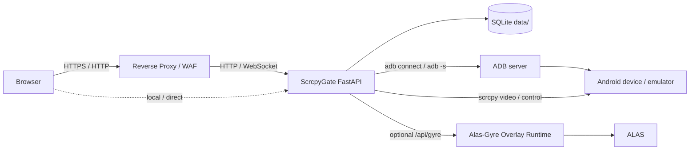

# ScrcpyGate

[English](README.en.md) | 简体中文

ScrcpyGate 是一个基于 FastAPI、原生 WebSocket 和 scrcpy 的浏览器投屏网关。它面向网络 ADB 设备、多人观看、权限控制、移动端操作、低上行带宽和反向代理部署场景。

它不是一个公开暴露 ADB 的简单网页外壳，而是一个带登录、设备授权、控制锁、安全边界、审计日志和可调画质策略的轻量管理网关。

## 目录

- [适用场景](#适用场景)
- [核心特性](#核心特性)
- [架构概览](#架构概览)
- [安全边界](#安全边界)
- [快速开始](#快速开始)
- [首次配置流程](#首次配置流程)
- [反向代理部署](#反向代理部署)
- [画质与流模式](#画质与流模式)
- [ALAS / Alas-Gyre Overlay](#alas--alas-gyre-overlay)
- [常用命令](#常用命令)
- [配置项](#配置项)
- [故障排查](#故障排查)
- [开发检查](#开发检查)
- [许可证](#许可证)

## 适用场景

ScrcpyGate 适合这些使用方式：

- 在局域网或反向代理后远程访问 Android 模拟器
- 多个用户观看同一台设备，但同一时间只允许一个人控制
- 不想把真实 ADB 地址、端口和控制能力直接暴露给普通用户
- 上行带宽有限，需要低码率、低分辨率输出和自动停止空闲投屏
- 需要把 ALAS 的启动、停止、重启能力代理到用户界面
- 希望 Docker 部署后保留清晰的审计日志和安全配置

不适合这些目标：

- 需要 USB ADB 即插即用管理
- 需要 WebRTC 超低延迟
- 需要浏览器直接访问 ALAS 原网页并隐藏配置列表
- 需要修改 Android 设备真实分辨率

## 核心特性

| 模块 | 能力 |
| --- | --- |
| 后端 | FastAPI、Uvicorn、原生 WebSocket |
| 视频 | scrcpy H264 输出，浏览器端 jMuxer 播放 |
| 数据 | SQLite，默认数据目录 `data/` |
| 用户 | 登录、管理员、普通用户、用户自助改密 |
| 设备 | 设备管理、权限分配、网络 ADB 自动连接、心跳保活 |
| 控制 | 显式控制锁，防止多人同时操作同一设备 |
| 画质 | 流畅、稳定、高清、低延迟预设，后台可调默认值 |
| 安全 | Host / Origin / CSRF / Trusted Proxy 检查，安全响应头 |
| 隐私 | 普通用户 API 和界面隐藏真实 ADB IP:端口 |
| ALAS | 代理 Alas-Gyre Overlay 的启动、停止、重启能力 |
| 运维 | Docker Compose、健康检查、审计日志、运行日志 |

## 架构概览



核心设计：

- 浏览器只访问 ScrcpyGate，不直接访问 ADB。
- 普通用户拿到的是设备公开 ID，不是真实 ADB 地址。
- 视频通道和控制通道分离。
- 多个浏览器可以观看同一设备，控制权由控制锁决定。
- ALAS Token 只保存在后端，普通用户前台不可见。

## 安全边界

ScrcpyGate 只调整 scrcpy 输出流，不修改 Android 设备或模拟器的真实显示参数。

严禁加入以下运行时能力：

- `wm size`
- `wm density`
- `modifydev`
- 修改 `Physical size`
- 修改 `Override size`

这对 ALAS 场景尤其重要，因为 ALAS 通常依赖固定的模拟器真实分辨率，例如 `1280x720`。网页里的“输出尺寸”只映射到 scrcpy `max_size`，不会改变设备真实分辨率。

还需要注意：

- 不要提交 `.env`、`data/`、数据库、日志或初始密码文件。
- 公网部署必须使用 HTTPS。
- 只有在请求确实来自可信反向代理时才启用 `TRUST_PROXY=true`。
- `TRUSTED_PROXY_IPS` 应填写反向代理的真实来源 IP 或 CIDR。
- 不建议把 ALAS 原网页直接暴露给普通用户。

## 快速开始

### 环境要求

- Docker
- Docker Compose
- 可通过网络 ADB 访问的 Android 设备或模拟器

### 启动服务

```bash
cp .env.example .env
docker compose -f docker-compose.v2.yml up -d --build
```

默认访问地址：

```text
http://127.0.0.1:5000
```

### 使用部署脚本

```bash
chmod +x deploy-v2.sh
./deploy-v2.sh
```

首次创建数据库时，脚本会输出初始管理员账号：

```text
username: admin
password: <auto-generated-password>
```

初始密码也会写入：

```text
data/initial_admin_password.txt
```

如果管理员密码已经被修改，初始密码命令会返回空值，这是预期行为。

## 首次配置流程

1. 使用 `admin` 登录后台。
2. 在“设备”页添加设备：
   - 设备 ID：建议使用别名，例如 `emu-1`
   - 名称：显示给用户看的名称
   - ADB 地址：真实连接地址，例如 `192.0.2.10:30100`
3. 点击“测试 ADB”，确认设备状态为 online。
4. 在“用户权限”页创建普通用户。
5. 给用户分配设备查看和控制权限。
6. 在“画质”页选择适合上行带宽的默认预设。
7. 回到投屏页，选择设备并开始投屏。

普通用户只能看到被授权设备，不会看到真实 ADB 地址。

## 反向代理部署

在 HTTPS、WAF 或反向代理后部署时，需要显式配置对外地址、Host、Origin 和可信代理来源。

示例：

```bash
WEB_SCRCPY_BIND=127.0.0.1 \
PUBLIC_BASE_URL=https://example.com \
ALLOWED_HOSTS=example.com,127.0.0.1,localhost \
ALLOWED_ORIGINS=https://example.com \
SESSION_COOKIE_SECURE=true \
TRUST_PROXY=true \
TRUSTED_PROXY_IPS=127.0.0.1 \
SCRCPY_STREAM_MODE=raw \
./deploy-v2.sh
```

如果反向代理不在同一台机器，请把 `TRUSTED_PROXY_IPS` 改成反向代理访问 ScrcpyGate 时的来源 IP。

如果局域网直接访问，可以使用：

```bash
WEB_SCRCPY_BIND=0.0.0.0 \
PUBLIC_BASE_URL=http://192.168.1.10:5000 \
ALLOWED_HOSTS=192.168.1.10,127.0.0.1,localhost \
ALLOWED_ORIGINS=http://192.168.1.10:5000 \
SESSION_COOKIE_SECURE=false \
TRUST_PROXY=false \
./deploy-v2.sh
```

把 `192.168.1.10` 替换为你的服务器局域网 IP。

## 画质与流模式

默认流模式：

```env
SCRCPY_STREAM_MODE=raw
```

建议保持 `raw` 作为默认模式。`protocol` 和 `legacy` 作为可选诊断能力保留，可以在后台启用后测试。

### 画质预设

| 预设 | 目标 | 建议场景 |
| --- | --- | --- |
| 流畅 | 尽量低码率 | 上行很紧张、移动网络 |
| 稳定 | 稳定优先 | 日常默认 |
| 高清 | 更清晰 | 上行较充足 |
| 低延迟 | 操作响应优先 | 需要频繁点击/滑动 |

后台可以修改每个预设的：

- 码率
- 输出尺寸
- 帧率

这些参数只影响 scrcpy 输出流。修改画质后可能需要重启投屏才能完全生效。

## ALAS / Alas-Gyre Overlay

ALAS 控制功能需要先安装并启动 Alas-Gyre 的 Overlay Runtime。ScrcpyGate 不直接运行 ALAS，只把用户操作代理到 Overlay API。

后台 ALAS 模块需要配置：

- Runtime URL，例如 `http://127.0.0.1:22267`
- API Token
- 当前配置名
- 用户和 ALAS 配置绑定关系

ScrcpyGate 还可以通过 `/alas/embed/` 代理嵌入 ALAS 原页面。管理员可访问完整原页面；普通用户必须先绑定 ALAS 配置，并只能访问绑定配置内的主页、任务、配置和设置。Runtime URL 可填写 IP、域名或完整 URL；未填写端口时会自动尝试 22267，域名会尝试 80、443、22267。

访问规则与安全注意事项：

- 普通用户前台入口为“打开 ALAS 页面”，管理员后台入口为“打开完整 ALAS 页面”。
- 普通用户只能访问自己绑定的单个 ALAS 配置；管理员可以访问完整 ALAS 原页面。
- HTTP / WebSocket 代理会校验登录态、用户角色和 ALAS 绑定关系，并拒绝其它配置、管理入口和未授权长连接消息。
- ALAS Runtime 地址和 Token 只保存在 ScrcpyGate 后端，不会在普通用户界面展示。
- 建议让 ALAS Runtime 只对 ScrcpyGate 或受信局域网可达，不要把 Runtime 直接暴露给普通用户或公网。

普通用户只能启动、停止、重启自己绑定的单个 ALAS 配置。前台不会暴露全部配置列表、配置内容和 Runtime Token。

相关项目：

- [ALAS / AzurLaneAutoScript](https://github.com/LmeSzinc/AzurLaneAutoScript)
- [Alas-Gyre Overlay](https://github.com/Ange-Katrina/Alas-Gyre)

## 常用命令

查看容器：

```bash
docker compose -f docker-compose.v2.yml ps
```

查看日志：

```bash
docker logs --tail=120 web-scrcpy-v2
```

停止服务：

```bash
docker compose -f docker-compose.v2.yml down
```

重新构建：

```bash
docker compose -f docker-compose.v2.yml up -d --build
```

查看初始密码：

```bash
docker compose -f docker-compose.v2.yml exec -T web-scrcpy-v2 python -m app.cli initial-password
```

重置管理员：

```bash
docker compose -f docker-compose.v2.yml exec -T web-scrcpy-v2 python -m app.cli reset-admin
```

查看健康状态：

```bash
curl -fsS http://127.0.0.1:5000/healthz
```

## 配置项

常用环境变量：

| 变量 | 默认值 | 说明 |
| --- | --- | --- |
| `WEB_SCRCPY_BIND` | `127.0.0.1` | 服务绑定地址 |
| `WEB_SCRCPY_PORT` | `5000` | 宿主机端口 |
| `WEB_SCRCPY_DATA_HOST` | `./data` | 宿主机数据目录 |
| `PUBLIC_BASE_URL` | `http://127.0.0.1:5000` | 对外访问地址 |
| `ALLOWED_HOSTS` | `127.0.0.1,localhost` | 允许的 Host |
| `ALLOWED_ORIGINS` | 空 | 允许的 Origin |
| `ALLOW_NULL_ORIGIN` | `false` | 是否允许 WAF/代理场景中的 `Origin: null` |
| `SESSION_COOKIE_SECURE` | `false` | 是否只通过 HTTPS 发送 Cookie |
| `TRUST_PROXY` | `false` | 是否信任反向代理头 |
| `TRUSTED_PROXY_IPS` | `127.0.0.1,::1` | 可信代理 IP 或 CIDR |
| `INITIAL_ADMIN_PASSWORD` | 空 | 可选的首次管理员密码 |
| `MIN_PASSWORD_LENGTH` | `12` | 最小密码长度 |
| `ADB_AUTOCONNECT` | `true` | 启动后自动连接已启用设备 |
| `ADB_HEARTBEAT_INTERVAL` | `15` | ADB 心跳间隔秒数 |
| `ADB_CONNECT_TIMEOUT` | `8` | ADB 连接超时秒数 |
| `ADB_RECONNECT_BACKOFF` | `5` | ADB 重连退避秒数 |
| `SCRCPY_STREAM_MODE` | `raw` | 默认 scrcpy 流模式 |
| `SCRCPY_STREAM_HEALTH_TIMEOUT` | `5` | 视频流健康检测超时 |
| `VIDEO_QUEUE_MAXSIZE` | `60` | 单客户端视频队列硬上限 |
| `VIDEO_QUEUE_SOFT_LIMIT` | `45` | 单客户端视频队列软上限，超过后等待关键帧恢复 |
| `LOG_LEVEL` | `INFO` | 日志级别 |

更多示例见 [.env.example](.env.example)。

## 项目结构

```text
./
  app/                    FastAPI 后端
  templates/              原生 HTML 页面
  static/                 前端 JS/CSS 资源
  tests/                  单元测试
  adb/                    Android platform-tools 兼容文件
  Dockerfile              Docker 镜像构建文件
  docker-compose.v2.yml   Docker Compose 配置
  deploy-v2.sh            部署辅助脚本
  README.md               中文说明
  README.en.md            English documentation
```

## 故障排查

### 访问显示 Forbidden

常见原因：

- `ALLOWED_HOSTS` 没有包含当前访问域名或 IP
- `ALLOWED_ORIGINS` 没有包含当前页面 Origin
- 反向代理或 WAF 让浏览器登录请求携带 `Origin: null`，但没有设置 `ALLOW_NULL_ORIGIN=true`
- 反向代理传了 `X-Forwarded-*`，但没有正确设置 `TRUST_PROXY` 和 `TRUSTED_PROXY_IPS`

处理：

```bash
docker logs --tail=120 web-scrcpy-v2
```

查看是否有 `HOST_REJECT`、`ORIGIN_REJECT` 或 `PROXY_HEADER_REJECT`。

### 登录后仍回到登录页

检查：

- HTTPS 部署时是否设置 `SESSION_COOKIE_SECURE=true`
- HTTP 局域网部署时是否错误设置了 `SESSION_COOKIE_SECURE=true`
- `PUBLIC_BASE_URL`、`ALLOWED_HOSTS`、`ALLOWED_ORIGINS` 是否一致

### 投屏启动失败

检查：

- 后台设备 ADB 地址是否正确
- 后台“测试 ADB”是否 online
- 容器内是否能访问设备网络
- 设备是否允许 ADB 调试

### 黑屏或花屏

建议：

- 默认使用 `raw` 流模式
- 降低画质预设的码率、输出尺寸和帧率
- 停止投屏后重新开始
- 查看运行日志里的 scrcpy 和 WebSocket 错误

### ALAS 无法启动

检查：

- Alas-Gyre Overlay Runtime 是否已启动
- Runtime URL 是否能从 ScrcpyGate 服务访问
- API Token 是否一致
- 用户是否绑定了 ALAS 配置

## 开发检查

编译检查：

```bash
python -m compileall -q .
```

单元测试：

```bash
python -m unittest discover -s tests
```

模板内联 JS 语法检查：

```bash
node -e "const fs=require('fs'); for (const f of ['templates/index.html','templates/admin.html','templates/login.html']) { const html=fs.readFileSync(f,'utf8'); const scripts=[...html.matchAll(/<script(?![^>]*\\bsrc=)[^>]*>([\\s\\S]*?)<\\/script>/gi)].map(m=>m[1]); scripts.forEach((s,i)=>new Function(s)); console.log(f+' ok'); }"
```

分辨率安全扫描：

```bash
rg -n "wm size|wm density|modifydev|Physical size|Override size" .
```

敏感信息扫描示例：

```bash
rg -n "BEGIN PRIVATE|BEGIN OPENSSH|ALAS_GYRE_API_TOKEN=|sk-[A-Za-z0-9]" .
```

## 许可证

ScrcpyGate 使用 Apache License 2.0。详见 [LICENSE](LICENSE)。

第三方组件和来源说明见 [THIRD_PARTY.md](THIRD_PARTY.md)。
